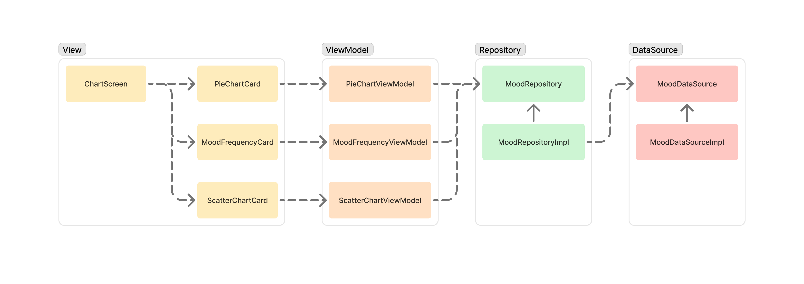

# 그대로
아이콘 하나로 직관적이게, 매일 짧고 가볍게 기록할 수 있는 감정 일기 앱.

### 기술 스택
Flutter, Riverpod, GoRouter, Isar, Mocktail, MVVM, Repository Pattern

## 주요 기능

- **일기**
    - 아이콘을 이용한 감정 표현.
    - 일기 작성.
    - 지금까지 작성한 일기 목록.
    - 날짜 범위 필터.
- **로컬 데이터 베이스**
    - `Isar`를 사용하여 로컬 데이터 베이스 구현.
- **통계**
    - 감정 아이콘 사용 비율을 표시하는 pie 차트.
    - 감정 아이콘 사용 순위와 갯수를 표시하는 리스트.
    - 시간대별 감정 기록량을 표시하는 scatter 차트.
    - 월별 통계 필터.
- **테마 관리**
    - `SharedPreferencesAsync`를 사용하여 테마 저장.
    - `AsyncNotifierProvider`로 테마를 제공하여 앱 전역에서 테마 일관성 유지.
- **UX 개선**
    - `StatefulShellRoute`를 사용하여 유저가 일기 작성 중 다른 탭으로 이동 후에도 내용 유지.
- **접근성 향상(Accessibility)**
    - Text scaling factor 지원으로 유저 접근성 강화.
- **다국어 지원**
    - 한국어, 영어, 일본어 지원.
- **기타**
    - GitHub Actions를 사용하여 유닛 테스트 자동화.
    - `Mocktail`을 사용하여 Mocking.

## Screenshot

| Home Screen | Wirte Screen | Chart Screen 1 |
| :-: | :-: | :-: |
|  |  |  |

| Home Screen Filter | Chart Screen Filter | Chart Screen 2 |
| :-: | :-: | :-: |
|  |  |  |

| Settings Screen |
| :-: |
|  |

## Structure


## Detail

### Theme
- 전역 함수로 `ThemeData` 제공.
- `SharedPreferencesAsync`를 사용하여 테마 저장.
  - `SharedPreferences`는 deprecated 예정이기 때문.
  - `String`으로 저장한 테마 데이터 변환을 위해 `AppThemeType`에 `fromString` 생성자 제공.
- `AsyncNotifierProvider`로 테마를 제공하여 앱 전역에서 테마 일관성 유지.

```dart
enum AppThemeType {
  cherryBlossom("Cherry Blossom"),
  apricot("Apricot"),
  almond("Almond"),
  ashGray("Ash Gray"),
  thistle("Thistle");

  final String text;

  const AppThemeType(this.text);

  factory AppThemeType.fromString(String text) {
    return values.firstWhere(
      (e) => e.text == text,
      orElse: () => AppThemeType.cherryBlossom,
    );
  }
...
}
```

### UX
- 유저가 일기 작성 중 다른 탭으로 이동 후에도 내용 유지.
  - 각 탭의 상태를 유지하기 위해 `StatefulShellRoute` 사용.

```dart
final routerProvider = Provider((ref) {
  return GoRouter(
    ...
    routes: [
      ...
      StatefulShellRoute.indexedStack(
        builder: (context, state, navigationShell) =>
            MainNavigationBar(navigationShell: navigationShell),
        branches: [
          StatefulShellBranch(
            routes: [
              GoRoute(
                path: RoutePath.home,
                builder: (context, state) => const HomeScreen(),
              ),
            ],
          ),
          ...
        ],
      ),
    ],
  );
});
```